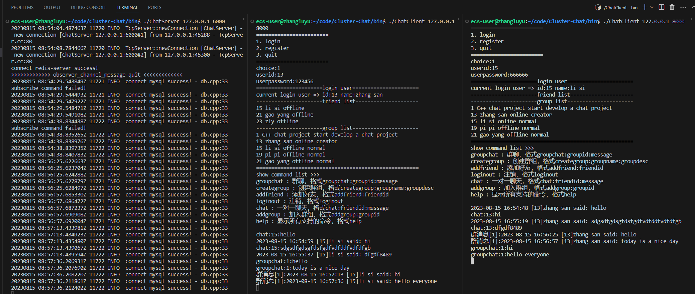
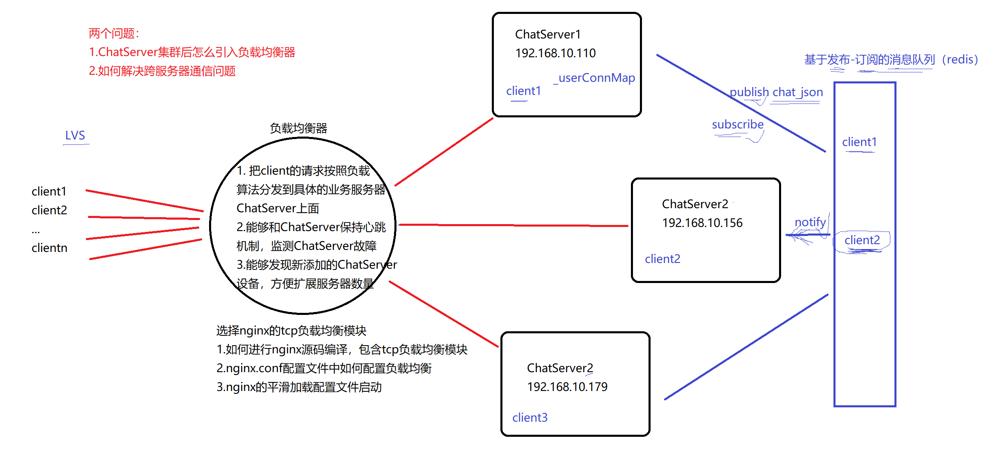

## 登录：
模拟服务器1：./ChatServer 127.0.0.1 6000
模拟服务器2：./ChatServer 127.0.0.1 6002

模拟客户端1：./ChatClient 127.0.0.1 8000
模拟客户端2：./ChatClient 127.0.0.1 8000



## 注意点：
1.互斥锁
```
// 登录成功，记录用户连接信息
{
    lock_guard<mutex> lock(_connMutex);
    _userConnMap.insert({id, conn});
}
```
